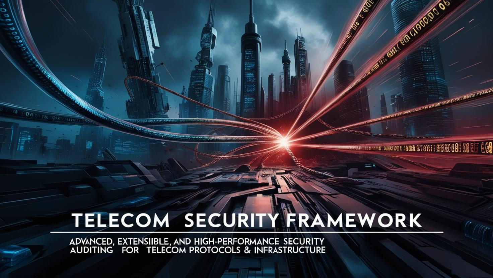

# Telecom Security Learning Roadmap

A comprehensive guide to learning telecom security based on the [telco-sec.com](https://www.telco-sec.com/) project structure.

## 🚀 Introduction

This roadmap provides a structured approach to learning telecom security from fundamentals to advanced topics. Following the methodology developed by RFS (telecom professional since 2010, testing telecom security boundaries since 1995) and the open community at [telco-sec.com](https://www.telco-sec.com/).

## 📋 Progress Tracking

| Phase | Topic | Status | Resources | Community Help Needed |
|-------|-------|--------|-----------|----------------------|
| 1️⃣ | Telecom Architecture Basics | ⬜ Not Started | [telco-sec.com](https://www.telco-sec.com/) | Documentation improvements |
| 1️⃣ | Essential Security Concepts | ⬜ Not Started | [telco-sec.com](https://www.telco-sec.com/) | Beginner guides |
| 1️⃣ | Setup Learning Environment | ⬜ Not Started | [Linux Tools](https://www.telco-sec.com/) | Setup scripts & tutorials |
| 2️⃣ | SIM Card Security | ⬜ Not Started | [01-sim-esim](https://github.com/TelcoSec/SIM-eSIM-Security-Research) | Lab examples |
| 2️⃣ | Baseband Security | ⬜ Not Started | [02-basebands](https://www.telco-sec.com/) | Hardware recommendations |
| 2️⃣ | Mobile Device Internals | ⬜ Not Started | [03-mobile-internals](https://www.telco-sec.com/) | Device testing guides |
| 3️⃣ | Radio Access Network Security | ⬜ Not Started | [04-ran](https://www.telco-sec.com/) | SDR examples |
| 3️⃣ | Core Network Security | ⬜ Not Started | [05-core-network](https://www.telco-sec.com/) | Virtual lab setups |
| 3️⃣ | Multi-RAT & Integration Security | ⬜ Not Started | [07-plmn-integration](https://www.telco-sec.com/) | Real-world examples |
| 4️⃣ | Protocol Analysis | ⬜ Not Started | [tools/online](https://www.telco-sec.com/) | Analysis tutorials |
| 4️⃣ | Vulnerability Assessment | ⬜ Not Started | [methodology](https://www.telco-sec.com/) | Test cases |
| 4️⃣ | Advanced Tools Development | ⬜ Not Started | [tools](https://www.telco-sec.com/) | Code contributions |
| 5️⃣ | Specialization & Research | ⬜ Not Started | [All areas](https://www.telco-sec.com/) | Research topics |

## 📚 Phase 1: Fundamentals (2-3 months)

### Telecom Architecture Basics
- Learn mobile network architecture (2G/3G/4G/5G)
- Understand protocol stacks and signaling
- Study the role of key components (SIM, baseband, RAN, core network)

**Tools:**
- [TelcoSecKali](https://www.telco-sec.com/) for a pre-configured learning environment
- Network architecture visualizers from [tools/online](https://www.telco-sec.com/)

**Community Help Needed:**
- Beginner-friendly network diagrams
- Technology comparison charts
- Simplified protocol explanations

### Essential Security Concepts
- Cryptography fundamentals (symmetric/asymmetric encryption, hashing)
- Authentication and authorization mechanisms
- Network security principles
- Threat modeling for telecom systems

**Tools:**
- [SS7 Protocol Analyzer](https://www.telco-sec.com/) to visualize security principles
- Security assessment frameworks from [tools](https://www.telco-sec.com/)

**Community Help Needed:**
- Telecom-specific security concept explanations
- Threat model templates
- Interactive learning materials

### Setup Learning Environment
- Install Linux tools for telecom security from [tools/linux](https://www.telco-sec.com/)
- Set up virtual lab environments
- Learn to use Wireshark for telecom protocol analysis

**Tools:**
- [TelcoSecDebian](https://www.telco-sec.com/) minimal distribution
- SDR tools suite for hardware interaction

**Community Help Needed:**
- Installation guides and troubleshooting
- Virtual machine templates
- Container configurations for quick start

## 🛠️ Phase 2: SIM and Device Security (2 months)

### SIM Card Technology and Security
- Learn about SIM card technology, internals, and types of SIM cards used in mobile devices.
- Understand GSM identifiers (ICCID, IMSI), authentication keys, and cryptographic mechanisms for secure communication.
- Explore SIM card security, including common attacks and best practices for protection.

**Resource:** [SIM Cards by Learn Telecom](https://sim-cards.learn-telecom.com/)

### GSM Security and Hacking
- Learn about GSM network architecture and common attack vectors (IMSI catchers, rogue BTS, SMS interception).
- Build and operate your own GSM Pentest LAB for hands-on security testing.
- Explore the security of GSM-based devices (alarms, trackers, smartwatches).

**Resource:** [GSM Hacking by TelcoSec](https://gsm-hacking.telco-sec.com/)

### SIM Card Security
- Study SIM architecture and file systems
- Explore authentication algorithms (COMP128, Milenage)
- Understand SIM Toolkit applications
- Learn about eSIM security and remote provisioning

**Tools:**
- [pySim](https://www.telco-sec.com/) for SIM card programming
- [SIMtrace](https://www.telco-sec.com/) for protocol analysis
- Osmocom SIM utilities

**Community Help Needed:**
- Safe testing environments documentation
- Algorithm implementation examples
- eSIM testing procedures

### Baseband Security
- Understand baseband architecture and processors
- Study radio protocol stack security
- Learn about baseband-application processor interfaces
- Explore firmware analysis techniques

**Tools:**
- Firmware extraction tools
- Binary analysis utilities
- Debugging interfaces

**Community Help Needed:**
- Baseband processor documentation
- Safe testing methodologies
- Sample firmware for analysis

### Mobile Device Internals
- Study secure boot chains
- Understand Trusted Execution Environments (TEE)
- Explore secure elements and hardware security modules
- Investigate the Radio Interface Layer (RIL)

**Tools:**
- [Mobile Forensics](https://www.telco-sec.com/) toolset
- [Android Security Tools](https://www.telco-sec.com/) including Frida instrumentation

**Community Help Needed:**
- Device-specific analysis guides
- TEE testing methodologies
- RIL interface documentation

## 🌐 Phase 3: Network Infrastructure (3 months)

### Diameter Protocol and Security
- Learn about the Diameter protocol, a key technology for authentication, authorization, and accounting in modern telecom networks (3G/4G/5G).
- Explore Diameter applications, nodes, AVPs (Attribute-Value Pairs), and interfaces (IMS, EPC, PCC, 3GPP systems).
- Understand security considerations and best practices for protecting Diameter-based communications.

**Resource:** [Learn Diameter](https://diameter.learn-telecom.com/)

### Radio Access Network Security
- Study eNodeB/gNodeB security
- Learn air interface security mechanisms
- Understand handover security
- Explore backhaul/fronthaul security concerns

**Tools:**
- [SDR Processing Frameworks](https://www.telco-sec.com/) like GNU Radio
- [Open Source Mobile Stacks](https://www.telco-sec.com/) like srsRAN and Open Air Interface

**Community Help Needed:**
- RAN testing setups
- Air interface security analysis guides
- Handover security testing procedures

### Core Network Security
- Study authentication frameworks
- Understand signaling security (SS7, Diameter, HTTP/2)
- Learn about roaming security and interconnect
- Explore virtualization security for telecom networks

**Tools:**
- [SS7 Tools](https://www.telco-sec.com/) including SigPloit
- [Diameter Tools](https://www.telco-sec.com/) for EPC testing
- [Network Core Components](https://www.telco-sec.com/) like Open5GS and free5GC

**Community Help Needed:**
- Core network lab setups
- Signaling security test cases
- Virtualization security checklists

### Multi-RAT and Integration Security
- Study cross-technology vulnerabilities
- Understand roaming integration security issues
- Learn multi-vendor integration challenges
- Explore cloud-native telecom security

**Tools:**
- [Integration Testing](https://www.telco-sec.com/) frameworks
- [Container Security](https://www.telco-sec.com/) tools for telco

**Community Help Needed:**
- Multi-vendor test environments
- Integration security checklists
- Cloud-native security practices

## 🔍 Phase 4: Practical Skills Development (3-4 months)

### Protocol Analysis
- Practice with SS7 protocol analyzer
- Explore Diameter protocol analysis
- Study GTP and SIP/RTP for VoLTE
- Learn SIM protocol analysis

#### SS7 Stack and Security
The Signaling System No. 7 (SS7) is a globally used set of telephony signaling protocols that enable call setup, routing, billing, and information exchange between telephone networks. The SS7 protocol suite is organized into a stack, structured in levels similar to the OSI model:

1. **MTP Level 1 (Physical Layer):** Physical and electrical connection for the network, handling delivery of signaling messages.
2. **MTP Level 2 (Link Layer):** Error checking and message sequence control, ensuring reliable transmission.
3. **MTP Level 3 (Network Layer):** Message routing between exchanges and integrity of signaling message transfer.
4. **SCCP (Signaling Connection Control Part):** Enhanced routing, supporting connection-oriented and connectionless services.
5. **TCAP (Transaction Capabilities Application Part):** Non-circuit-related queries and transactions (e.g., number translation, roaming).
6. **ISUP (ISDN User Part):** Setup and teardown of voice/data calls over PSTN.
7. **MAP (Mobile Application Part):** Mobile network functions such as roaming, location updating, handovers, and SMS delivery.

**Security Relevance:**
- SS7 has several well-documented vulnerabilities, including subscriber information disclosure, network information disclosure, traffic interception, fraud, and denial of service.
- Attackers can exploit SS7 to intercept calls and SMS, track location, and perform fraud.
- Understanding the SS7 stack and its vulnerabilities is crucial for telecom security professionals.

For a detailed overview and attack scenarios, see the [SS7 Stack Overview](https://ss7-attacks.telco-sec.com/).

**Tools:**
- [SS7 Protocol Analyzer](https://www.telco-sec.com/)
- [Wireshark](https://www.telco-sec.com/) with telecom dissectors
- [SIMtrace](https://www.telco-sec.com/) for SIM protocols
- [Telecommunications Research Toolkit](https://github.com/TelcoSec/Telecommunications-Research-Toolkit) – open-source tools for telecom protocol analysis and research

**Community Help Needed:**
- Protocol analysis tutorials
- Sample captures for learning
- Analysis methodology documentation

### Vulnerability Assessment
- Conduct security assessments of telecom components
- Learn penetration testing for telecom systems
- Practice with testing methodologies from the project
- Document findings using industry standards

**Tools:**
- [Security Testing Framework](https://www.telco-sec.com/)
- [Vulnerability Management System](https://www.telco-sec.com/)

**Community Help Needed:**
- Assessment templates
- Reporting standards
- Test case development

### Advanced Tools Development
- Contribute to existing tools or develop your own
- Practice with the project's SDR-based tools
- Work with open-source mobile stacks and core components
- Build automated testing frameworks

**Tools:**
- Development environment setups
- [CI/CD pipeline](https://www.telco-sec.com/) for tool testing
- [Telecommunications Research Toolkit](https://github.com/TelcoSec/Telecommunications-Research-Toolkit) – open-source tools for telecom protocol analysis and research

**Community Help Needed:**
- Tool development ideas
- Code reviews
- Documentation improvements

## 🚀 Phase 5: Specialization and Research (Ongoing)

### Choose a Focus Area
- Select a specialization based on your interests (SIM security, baseband, core network, etc.)
- Conduct deeper research in your chosen area
- Follow the latest vulnerabilities and mitigation techniques

**Tools:**
- Technology-specific tools from [06-technologies](https://www.telco-sec.com/)
- Research documentation templates

**Community Help Needed:**
- Research area suggestions
- Collaboration opportunities
- Resource sharing

### Community Engagement
- Contribute to open-source telecom security projects
- Participate in the [telco-sec.com](https://www.telco-sec.com/) community
- Share research findings and tools
- Collaborate on vulnerability research

**Tools:**
- Forum/discussion board at [telco-sec.com](https://www.telco-sec.com/)
- Knowledge base system

**Community Help Needed:**
- Discussion moderation
- Knowledge organization
- Research collaboration

### Keep Up with Evolution
- Follow telecom technology evolution (5G/6G)
- Study emerging trends (O-RAN, network slicing)
- Understand new attack vectors with each generation
- Learn about advanced threat actors targeting telecom

**Tools:**
- [Threat Intelligence Platform](https://www.telco-sec.com/)
- Research Paper Database

**Community Help Needed:**
- Technology trend analysis
- New vulnerability research
- Threat intelligence sharing

## 🤝 Community Contributions

The [telco-sec.com](https://www.telco-sec.com/) project is an open community, and we welcome contributions in all areas:

1. **Documentation improvements** - Help make telecom security more accessible
2. **Tool development** - Contribute to existing tools or create new ones
3. **Research findings** - Share your discoveries with the community
4. **Training materials** - Create tutorials, labs, and exercises
5. **Vulnerability disclosure** - Responsibly report vulnerabilities you discover

Please see our [Contribution Guidelines](https://www.telco-sec.com/) before submitting your work.

## 📊 Self-Assessment Checklist

Rate your knowledge in each area to identify where to focus:

- [ ] I understand basic telecom network architecture
- [ ] I can explain authentication in mobile networks
- [ ] I know how SIM cards protect cryptographic keys
- [ ] I understand the security boundaries of baseband processors
- [ ] I can identify security issues in radio access networks
- [ ] I know core network signaling vulnerabilities
- [ ] I can perform basic protocol analysis
- [ ] I'm familiar with telecom security tools

## 📚 Resources

- **Project website**: [telco-sec.com](https://www.telco-sec.com/)
- **GitHub repository**: [github.com/telco-sec](https://www.telco-sec.com/)
- **Documentation**: [telco-sec.com/docs](https://www.telco-sec.com/)
- **Tools**: [telco-sec.com/tools](https://www.telco-sec.com/)
- **Community**: [telco-sec.com/community](https://www.telco-sec.com/)
- **Telecommunications Research Toolkit**: [github.com/TelcoSec/Telecommunications-Research-Toolkit](https://github.com/TelcoSec/Telecommunications-Research-Toolkit) – open-source tools for telecom protocol analysis and research
- **TelcoSec Blog**: [blog.telco-sec.com](https://blog.telco-sec.com/) – tutorials, guides, and the latest telecom security research

## ⚠️ Responsible Disclosure

All research conducted using this roadmap and the associated tools should follow responsible disclosure principles. Always:

1. Report vulnerabilities to affected vendors first
2. Follow established disclosure timelines
3. Prioritize security and safety of networks and users
4. Comply with applicable laws and regulations

For more information, see our [Responsible Disclosure Policy](https://www.telco-sec.com/).

---

*This roadmap is maintained by the [telco-sec.com](https://www.telco-sec.com/) community.*
